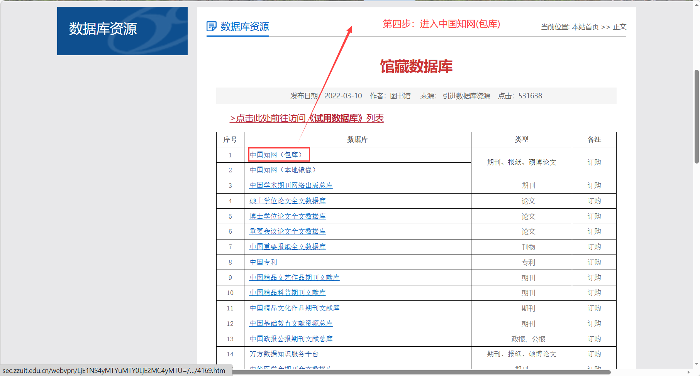

# 电脑异地登录郑州工业应用技术学院知网教程

本教程旨在帮助同学们在校外异地快速、便捷地访问中国知网（CNKI）数据库。

---

### 第一步：进入学校官网
打开浏览器，进入郑州工业应用技术学院官网：[https://zzuit.edu.cn](https://zzuit.edu.cn)

---

### 第二步：打开图书馆藏
在学校官网首页，找到并点击页面右上角的 **“图书馆藏”**。

---

### 第三步：进入馆藏数据库并登录
在图书馆页面，点击导航栏中的 **“馆藏数据库”**。
随后会跳转到资源访问控制系统登录界面：
* **账号**：手机号（或学号）
* **密码**：身份证后六位

---

### 第四步：进入中国知网（包库）
登录成功后，在馆藏数据库列表中，找到并点击 **“中国知网（包库）”**。

---

### 第五步：访问成功
成功进入中国知网！你可以看到右上角显示了学校名称，现在可以自由检索和下载文献了。
**如果这个教程对你有帮助，欢迎点赞支持！👍**

